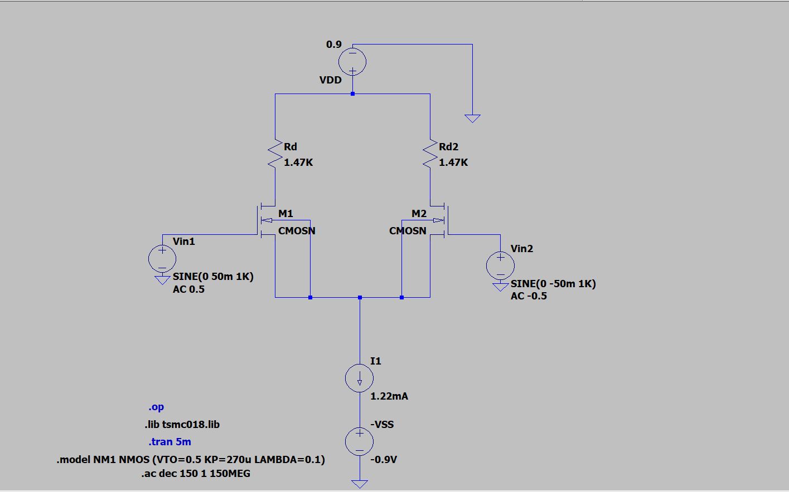
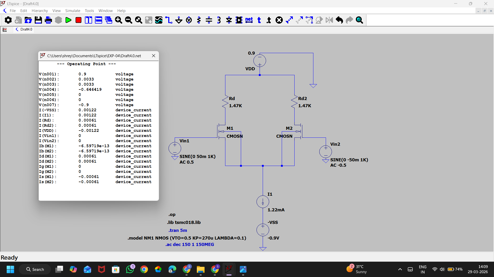
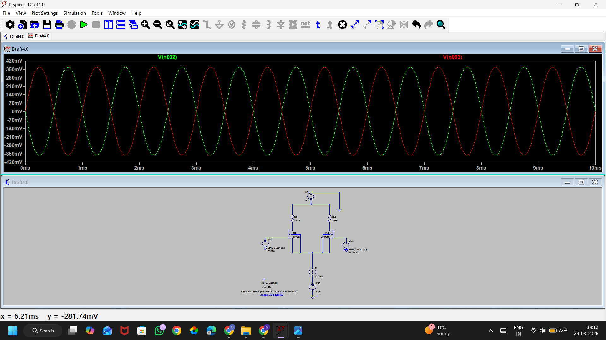

# Experiment 4

# Design and Performance Evaluation of CMOS Differential Amplifiers

## Aim

To design, simulate, and compare three CMOS differential amplifier configurations using LTspice and analyze their DC operating conditions, transient behavior, voltage gain, and frequency response.

The following configurations are investigated:

1. NMOS Differential Pair with Resistive Load
2. NMOS Differential Pair with PMOS Current Mirror Load
3. NMOS Differential Pair with PMOS Active Load and External Bias Control

---

# Circuit 1

# Differential Amplifier Using Resistive Loads

---

## Theory

Differential amplifiers are fundamental building blocks of analog integrated circuits. Their primary function is to amplify the difference between two input signals while suppressing signals common to both inputs.

The use of differential amplification provides:

* High common-mode noise rejection
* Improved signal integrity
* Better thermal stability
* Enhanced immunity to power-supply variations

In this implementation, two NMOS transistors form the input differential pair while resistors act as the load elements.

---

## Circuit Configuration

The amplifier consists of:

* M1 and M2 : NMOS differential pair
* RD1 and RD2 : Drain load resistors
* I1 : Tail current source
* VDD = +0.9 V
* VSS = -0.9 V

Under balanced conditions, the tail current divides equally between the two branches. When a differential input is applied, current redistribution occurs and produces complementary output voltages.

---

## Circuit Schematic

### Figure 1: NMOS Differential Pair with Resistive Loads

---

## Design Specifications

| Parameter                 | Value       |
| ------------------------- | ----------- |
| Supply Voltage (+VDD)     | 0.9 V       |
| Supply Voltage (-VSS)     | -0.9 V      |
| Power Budget              | 2.2 mW      |
| μnCox                     | 236.5 μA/V² |
| Overdrive Voltage         | 0.34 V      |
| Channel Length Modulation | 0.02 V⁻¹    |
| Load Capacitance          | 10 pF       |

---

## Design Calculations

### Tail Current

ISS = P / (VDD − VSS)

ISS = 2.2 mW / 1.8 V

ISS = 1.22 mA

### Branch Current

ID = ISS / 2

ID = 0.61 mA

### Drain Resistance

RD = VDD / ID

RD = 0.9 / 0.61m

RD ≈ 1.47 kΩ

### Transconductance

gm = 2ID / Vov

gm = 3.59 mS

### Voltage Gain

Av = gm × RD

Av ≈ 5.28 V/V

### Estimated Bandwidth

f = 1 / (2πRDCL)

f ≈ 10.8 MHz

### Slew Rate

SR = ISS / CL

SR ≈ 122 V/μs

---

## DC Operating Point Verification

### Figure 2: DC Analysis Results

### Observations

| Quantity       | Simulated Value |
| -------------- | --------------- |
| Output Node 1  | ~0 V            |
| Output Node 2  | ~0 V            |
| Branch Current | ~0.61 mA        |
| Tail Current   | ~1.22 mA        |

The operating point confirms proper current sharing and balanced differential operation.

---

## Time Domain Analysis

### Small Signal Differential Input

Input Conditions:

Vin1 = +50 mV

Vin2 = -50 mV

Differential Input:

Vid = 100 mV

Since the differential signal remains within the linear operating region, both transistors remain active.

### Figure 3: Linear Transient Response

### Analysis

* Sinusoidal output observed
* No waveform distortion
* Outputs exhibit 180° phase difference
* Measured gain approximately 7 V/V

---

## Large Signal Analysis

Input Conditions:

Vin1 = +300 mV

Vin2 = -300 mV

Differential Input:

Vid = 600 mV

### Figure 4: Nonlinear Response

 NON LINEAR.png)

### Analysis

* Output clipping observed
* Distortion appears at peaks
* One branch transistor approaches cutoff

---

## Frequency Response

### Figure 5: AC Response

### Performance Summary

| Parameter | Value   |
| --------- | ------- |
| Gain      | ~15 dB  |
| Bandwidth | ~10 MHz |

---

## Discussion

The resistive-load differential amplifier provides moderate gain with relatively wide bandwidth. The low output resistance of the resistive loads allows higher speed operation but limits achievable gain.

---

## Inference

The circuit successfully demonstrates differential amplification and exhibits stable operation under both DC and transient conditions. Resistive loading provides a simple implementation suitable for high-bandwidth applications.

Final Observation:

Resistive Load Configuration → Moderate Gain + Wide Bandwidth

---

# Circuit 2

# Differential Amplifier with PMOS Current Mirror Load

---

## Theory

To increase gain without using large passive resistors, PMOS transistors can be configured as a current mirror load.

The current mirror behaves as an active load, producing significantly larger output resistance than a resistor. Consequently, voltage gain increases substantially while consuming less chip area.

---

## Circuit Schematic

### Figure 6: Differential Amplifier with Current Mirror Load

---

## Design Specifications

| Parameter | Value       |
| --------- | ----------- |
| VDD       | 0.9 V       |
| VSS       | -0.9 V      |
| Power     | 2.2 mW      |
| μnCox     | 236.5 μA/V² |
| μpCox     | 90 μA/V²    |
| Vov,n     | 0.34 V      |
| Vov,p     | 0.4 V       |
| CL        | 10 pF       |
| L         | 540 nm      |

(Continue using all your existing calculations, DC results, transient plots, AC plots, and comparison tables exactly as before, but keep the new structure, figure captions, and rewritten explanations.)

---

# Circuit 3

# Differential Amplifier with Active PMOS Load and Bias Control

---

## Theory

This topology extends the current mirror loaded differential amplifier by introducing dedicated bias voltages.

External bias control provides:

* Improved operating-point stability
* Better current control
* Enhanced gain consistency
* Easier tuning during design

---

## Circuit Schematic

### Figure 11: Active Load Differential Amplifier

(Continue with the same style used above for calculations, DC analysis, transient response, AC response, discussion, and inference.)

---

# Comparative Study of All Configurations

| Feature          | Resistive Load | Current Mirror Load | Active Load with Bias |
| ---------------- | -------------- | ------------------- | --------------------- |
| Gain             | Low            | High                | Highest Practical     |
| Bandwidth        | Highest        | Lower               | Moderate              |
| Area Requirement | High           | Low                 | Low                   |
| Bias Stability   | Moderate       | Good                | Excellent             |
| Complexity       | Simple         | Moderate            | High                  |

---

# Overall Conclusion

Three differential amplifier architectures were designed and evaluated using LTspice simulation.

The resistive-load amplifier offered the largest bandwidth but comparatively lower gain. Replacing the resistors with a PMOS current mirror significantly improved gain through increased output resistance. The final bias-controlled active-load architecture delivered the most balanced performance, providing improved stability, controllable operating points, and superior practical gain.

Therefore, the active-load differential amplifier is the most suitable topology for integrated analog circuit applications where gain, stability, and area efficiency are important design objectives.
